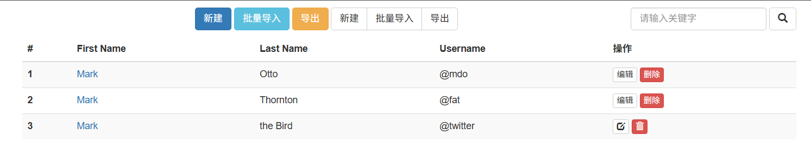

BootStap，是别人写好的一堆CSS样式

- 什么样式 ---> 效果
- BootStrap 引入 + 应用项目

> 这里使用 BootStrap 3，因为文档比较健全
>
> https://v3.bootcss.com/

# 快速上手

- 本地测试

首先，先在css文件中引入bootstrap

```python
<link rel="stylesheet" href="./bootstrap-3.4.1/css/bootstrap.css">
```

然后**在文档中**，找到自己需要的样式，然后加入到html中的元素上

> 这里的 class="btn btn-primary"  就是上面`bootstrap.css`中的样式

```python
<body>
    <input class="btn btn-primary" type="button" value="提交">
    
    <a class="btn btn-success">点击跳转</a>
</body>
```

- 在Flask项目中


# 必备样式

## container


```html
<head>
    <link rel="stylesheet" href="./bootstrap-3.4.1/css/bootstrap.css">
</head>

<body>
    <div class="container" style="background-color: aquamarine;">中国联通</div>

    <div class="container-fluid" style="background-color: antiquewhite;">中国移动</div>
</body>
```

## 响应式布局

根据你设备屏幕的大小，自动调整页面上的展示效果

```html
<!DOCTYPE html>
<html lang="en">
<head>
    <meta charset="UTF-8">
    <meta name="viewport" content="width=device-width, initial-scale=1.0">
    <title>Document</title>
    <style>
        .mine {
            height: 100px;
            background-color: red;
        }

        /* <1000 */
        @media (max-width: 1000px) {
            .mine {
                background-color: aqua;
            }
        }

        /* <500 */
        @media (max-width: 500px) {
            .mine  {
                background-color: blue;
            }
        }
    </style>
</head>
<body>
    <div class="mine"></div>
</body>
</html>
```

## 栅格系统

帮我们做页面布局。一行等分12份。（float：left）

- lg，>1200，左右展示；否则，块级一个占一行
- md，>992，左右展示；否则，块级一个占一行
- sm，>768，左右展示；否则，块级一个占一行
- xs，左右展示

```html
<body>
    <div class="clearfix" style="border: 1px solid red;">
        <div class="col-lg-10" style="background-color: red;">左边</div>
        <div class="col-lg-2" style="background-color: green;">右边</div>
    </div>
</body>
```

```html
<body>
    <div class="clearfix" style="border: 1px solid red;">
        <div class="col-md-10" style="background-color: red;">左边</div>
        <div class="col-md-2" style="background-color: green;">右边</div>
    </div>
</body>
```

```html
<body>
    <div class="clearfix" style="border: 1px solid red;">
        <div class="col-sm-10" style="background-color: red;">左边</div>
        <div class="col-sm-2" style="background-color: green;">右边</div>
    </div>
</body>
```

```html
<body>
    <div class="clearfix" style="border: 1px solid red;">
        <div class="col-xs-10" style="background-color: red;">左边</div>
        <div class="col-xs-2" style="background-color: green;">右边</div>
    </div>
</body>
```

## 案例：表单

```html
<body>
    <div style="width: 400px; border: 1px solid red;">
        <div class="clearfix">
            <div class="col-xs-3">用户名</div>
            <div class="col-xs-9"><input type="text"></div>
        </div>

        <div class="clearfix">
            <div class="col-xs-3">密码</div>
            <div class="col-xs-9"><input type="password"></div>
        </div>
		
        # 前面空格部分占3分
        <div class="clearfix">
            <div class="col-xs-offset-3 col-xs-9"> 
                <input type="submit" value="登录" class="btn btn-primary">
            </div>
        </div>
    </div>
</body>
```

## 按钮

按钮的两种编写方式：

```html
<input type="button" value="点我">
<button type="button">点我</button>
```

使用样式：

```html
<body>
    <input class="btn btn-primary" type="button" value="点我">
    <button class="btn btn-primary" type="button">点我</button>

    <input class="btn btn-danger" type="button" value="点我">
    <button class="btn btn-danger" type="button">点我</button>

    <a class="btn btn-success">点点我</a>
    <a class="btn btn-success btn-xs">点点我</a>

    <div style="width: 300px; border: 1px solid red; padding: 30px;">
        <h3>用户登录</h3>
        <div>...</div>
        <a class="btn btn-danger btn-xs btn-block">点点我</a>
    </div>
</body>
```


## 表单

```html
<body>
    <div class="box1">
        <input type="text">
        <input type="text" class="form-control">
    </div>

    <div class="box2">
        <form>
            <div class="form-group">
                <label for="exampleInputEmail1">Email address</label>
                <input type="email" class="form-control" id="exampleInputEmail1" placeholder="Email">
            </div>

            <div class="form-group">
                <label for="exampleInputPassword1">Password</label>
                <input type="password" class="form-control" id="exampleInputPassword1" placeholder="Password">
            </div>

            <div class="form-group">
                <label for="exampleInputFile">File input</label>
                <input type="file" id="exampleInputFile">
                <p class="help-block">Example block-level help text here.</p>
            </div>

            <div class="checkbox">
                <label>
                    <input type="checkbox"> Check me out
                </label>
            </div>

            <button type="submit" class="btn btn-default">Submit</button>
        </form>
    </div>

    <div class="box2">
        <form class="form-horizontal">
            <div class="form-group">
                <label for="inputEmail3" class="col-sm-2 control-label">Email</label>
                <div class="col-sm-10">
                    <input type="email" class="form-control" id="inputEmail3" placeholder="Email">
                </div>
            </div>
            
            <div class="form-group">
                <label for="inputPassword3" class="col-sm-2 control-label">Password</label>
                <div class="col-sm-10">
                    <input type="password" class="form-control" id="inputPassword3" placeholder="Password">
                </div>
            </div>

            <div class="form-group">
                <div class="col-sm-offset-2 col-sm-10">
                    <div class="checkbox">
                        <label>
                            <input type="checkbox"> Remember me
                        </label>
                    </div>
                </div>
            </div>

            <div class="form-group">
                <div class="col-sm-offset-2 col-sm-10">
                    <button type="submit" class="btn btn-default">Sign in</button>
                </div>
            </div>
        </form>
    </div>
</body>
```

## 案例：登录页面

```html
<!DOCTYPE html>
<html lang="en">
<head>
    <meta charset="UTF-8">
    <meta name="viewport" content="width=device-width, initial-scale=1.0">
    <title>登录页面</title>
    <link rel="stylesheet" href="./bootstrap-3.4.1/css/bootstrap.css">
    <style>
        .box {
            width: 400px;
            min-height: 100px;
            margin: 100px auto 0 auto;
            border: 1px solid #dddddd;
            padding: 0 20px;
        }

        .box h2 {
            text-align: center;
        }
    </style>
</head>
<body>
    <div class="box">
        <h2>用户登录</h2>

        <form>
            <div class="form-group">
                <label for="role">角色</label>
                <select class="form-control">
                    <option>普通用户</option>
                    <option>管理员</option>
                    <option>浏览用户</option>
                </select>
            </div>

            <div class="form-group">
                <label for="user">用户名</label>
                <input type="text" class="form-control" id="user" placeholder="请输入用户名">
            </div>

            <div class="form-group">
                <label for="password">密码</label>
                <input type="password" class="form-control" id="password" placeholder="请输入密码">
            </div>

            <div class="form-group">
                <label for="code">验证码</label>
                <div class="row">
                    <div class="col-xs-7">
                        <input type="text" class="form-control" id="code" placeholder="请输入验证码">
                    </div>
                    <div class="col-xs-5">
                        
                    </div>
                </div>
            </div>

            <div class="form-group">
                <label for="sms">短信验证码</label>
                <div class="row">
                    <div class="col-xs-7">
                        <input type="text" class="form-control" id="sms" placeholder="请输入短信验证码">
                    </div>
                    <div class="col-xs-5">
                        <input type="button" value="发送验证码" class="btn btn-default btn-block" disabled="disabled">
                    </div>
                </div>
            </div>

            <button type="submit" class="btn btn-primary">登 录</button>
            <span style="color: red;">用户名或密码错误</span>
        </form>
    </div>
</body>
</html>
```


## 导航

jquery：https://jquery.com/download/

这里下载相关文件

```html
<!DOCTYPE html>
<html lang="en">

<head>
    <meta charset="UTF-8">
    <meta name="viewport" content="width=device-width, initial-scale=1.0">
    <title>导航栏</title>
    <link rel="stylesheet" href="./bootstrap-3.4.1/css/bootstrap.css">
</head>

<body>
    <nav class="navbar navbar-default">
        <div class="container-fluid">
            <!-- Brand and toggle get grouped for better mobile display -->
            <div class="navbar-header">
                <button type="button" class="navbar-toggle collapsed" data-toggle="collapse"
                    data-target="#bs-example-navbar-collapse-1" aria-expanded="false">
                    <span class="sr-only">Toggle navigation</span>
                    <span class="icon-bar"></span>
                    <span class="icon-bar"></span>
                    <span class="icon-bar"></span>
                </button>
                <a class="navbar-brand" href="#">Brand</a>
            </div>

            <!-- Collect the nav links, forms, and other content for toggling -->
            <div class="collapse navbar-collapse" id="bs-example-navbar-collapse-1">
                <ul class="nav navbar-nav">
                    <li class="active"><a href="#">Link <span class="sr-only">(current)</span></a></li>
                    <li><a href="#">Link</a></li>
                    <li class="dropdown">
                        <a href="#" class="dropdown-toggle" data-toggle="dropdown" role="button" aria-haspopup="true"
                            aria-expanded="false">Dropdown <span class="caret"></span></a>
                        <ul class="dropdown-menu">
                            <li><a href="#">Action</a></li>
                            <li><a href="#">Another action</a></li>
                            <li><a href="#">Something else here</a></li>
                            <li role="separator" class="divider"></li>
                            <li><a href="#">Separated link</a></li>
                            <li role="separator" class="divider"></li>
                            <li><a href="#">One more separated link</a></li>
                        </ul>
                    </li>
                </ul>
                <form class="navbar-form navbar-left">
                    <div class="form-group">
                        <input type="text" class="form-control" placeholder="Search">
                    </div>
                    <button type="submit" class="btn btn-default">Submit</button>
                </form>
                <ul class="nav navbar-nav navbar-right">
                    <li><a href="#">Link</a></li>
                    <li class="dropdown">
                        <a href="#" class="dropdown-toggle" data-toggle="dropdown" role="button" aria-haspopup="true"
                            aria-expanded="false">Dropdown <span class="caret"></span></a>
                        <ul class="dropdown-menu">
                            <li><a href="#">Action</a></li>
                            <li><a href="#">Another action</a></li>
                            <li><a href="#">Something else here</a></li>
                            <li role="separator" class="divider"></li>
                            <li><a href="#">Separated link</a></li>
                        </ul>
                    </li>
                </ul>
            </div><!-- /.navbar-collapse -->
        </div><!-- /.container-fluid -->
    </nav>


    <script src="./jquery-3.7.1.min.js"></script>
    <script src="./bootstrap-3.4.1/js/bootstrap.js"></script>
</body>

</html>
```

- 固定导航栏  `<nav class="navbar navbar-default navbar-fixed-top">`
- 反色导航栏：`<nav class="navbar navbar-default navbar-fixed-top navbar-inverse">`

## 表格

```html
<div class="container">
    <table class="table table-striped">
        <thead>
            <tr>
                <th>#</th>
                <th>First Name</th>
                <th>Last Name</th>
                <th>Username</th>
            </tr>
        </thead>
        <tbody>
            <tr>
                <th scope="row">1</th>
                <td>Mark</td>
                <td>Otto</td>
                <td>@mdo</td>
            </tr>
            <tr>
                <th scope="row">2</th>
                <td>Jacob</td>
                <td>Thornton</td>
                <td>@fat</td>
            </tr>
            <tr>
                <th scope="row">3</th>
                <td>Larry</td>
                <td>the Bird</td>
                <td>@twitter</td>
            </tr>
        </tbody>
    </table>
</div>
```

## 案例：表格 + 常见操作


```html
<!DOCTYPE html>
<html lang="en">

<head>
    <meta charset="UTF-8">
    <meta name="viewport" content="width=device-width, initial-scale=1.0">
    <title>表格</title>
    <link rel="stylesheet" href="./bootstrap-3.4.1/css/bootstrap.css">
</head>

<body>
    <div class="container">
        <table class="table table-striped">
            <thead>
                <tr>
                    <th>#</th>
                    <th>First Name</th>
                    <th>Last Name</th>
                    <th>Username</th>
                    <th>操作</th>
                </tr>
            </thead>
            <tbody>
                <tr>
                    <th scope="row">1</th>
                    <td>
                        <a href="https://www.baidu.com">Mark</a>
                    </td>
                    <td>Otto</td>
                    <td>@mdo</td>
                    <td>
                        <a href="#" class="btn btn-default btn-xs">编辑</a>
                        <a href="#" class="btn btn-danger btn-xs">删除</a>
                    </td>
                </tr>
                <tr>
                    <th scope="row">2</th>
                    <td>
                        <a href="https://www.baidu.com">Mark</a>
                    </td>
                    <td>Thornton</td>
                    <td>@fat</td>
                    <td>
                        <a href="#" class="btn btn-default btn-xs">编辑</a>
                        <a href="#" class="btn btn-danger btn-xs">删除</a>
                    </td>
                </tr>
                <tr>
                    <th scope="row">3</th>
                    <td>
                        <a href="https://www.baidu.com">Mark</a>
                    </td>
                    <td>the Bird</td>
                    <td>@twitter</td>
                    <td>
                        <a href="#" class="btn btn-default btn-xs">
                            <span class="glyphicon glyphicon-edit" aria-hidden="true"></span>
                        </a>
                        <a href="#" class="btn btn-danger btn-xs">
                            <span class="glyphicon glyphicon-trash" aria-hidden="true"></span>
                        </a>
                    </td>
                </tr>
            </tbody>
        </table>
    </div>

</body>

</html>
```

- 新增

```html
<div class="container">
        <div style="margin: 10px 0; text-align: center;">
            <a class="btn btn-primary">新建</a>
            <a class="btn btn-info">批量导入</a>
            <a class="btn btn-warning">导出</a>

            <div class="btn-group" role="group">
                <button type="button" class="btn btn-default">新建</button>
                <button type="button" class="btn btn-default">批量导入</button>
                <button type="button" class="btn btn-default">导出</button>
            </div>
        </div>

        <table class="table table-striped">
            ...
        </table>
    </div>
```

## 表格 + 按钮



```html
<div class="container">
    <div style="margin: 10px 0; text-align: center;">
        <a class="btn btn-primary">新建</a>
        <a class="btn btn-info">批量导入</a>
        <a class="btn btn-warning">导出</a>

        <div class="btn-group" role="group">
            <button type="button" class="btn btn-default">新建</button>
            <button type="button" class="btn btn-default">批量导入</button>
            <button type="button" class="btn btn-default">导出</button>
        </div>

        <div style="float: right;">
            <form class="form-inline">
                <div class="form-group">
                    <input type="email" class="form-control" placeholder="请输入关键字">
                </div>

                <!-- <button type="submit" class="btn btn-default">搜索</button> -->
                <button type="submit" class="btn btn-default">
                    <span class="glyphicon glyphicon-search" aria-hidden="true"></span>
                </button>
            </form>
        </div>
    </div>

    <table class="table table-striped">
        ...
    </table>
</div>
```


## 案例：导航 + 表格


```html
<body>
    <nav class="navbar navbar-default" style="border-radius: 0; margin-bottom: 5px;">
        <div class="container-fluid">
            <div class="navbar-header">
                <button type="button" class="navbar-toggle collapsed" data-toggle="collapse"
                    data-target="#bs-example-navbar-collapse-1" aria-expanded="false">
                    <span class="sr-only">Toggle navigation</span>
                    <span class="icon-bar"></span>
                    <span class="icon-bar"></span>
                    <span class="icon-bar"></span>
                </button>
                <a class="navbar-brand" href="#">Brand</a>
            </div>


            <div class="collapse navbar-collapse" id="bs-example-navbar-collapse-1">
                <ul class="nav navbar-nav">
                    <li class="active"><a href="#">Link <span class="sr-only">(current)</span></a></li>
                    <li><a href="#">Link</a></li>
                    <li class="dropdown">
                        <a href="#" class="dropdown-toggle" data-toggle="dropdown" role="button" aria-haspopup="true"
                            aria-expanded="false">Dropdown <span class="caret"></span></a>
                        <ul class="dropdown-menu">
                            <li><a href="#">Action</a></li>
                            <li><a href="#">Another action</a></li>
                            <li><a href="#">Something else here</a></li>
                            <li role="separator" class="divider"></li>
                            <li><a href="#">Separated link</a></li>
                            <li role="separator" class="divider"></li>
                            <li><a href="#">One more separated link</a></li>
                        </ul>
                    </li>
                </ul>

                <form class="navbar-form navbar-left">
                    <div class="form-group">
                        <input type="text" class="form-control" placeholder="Search">
                    </div>
                    <button type="submit" class="btn btn-default">Submit</button>
                </form>

                <ul class="nav navbar-nav navbar-right">
                    <li><a href="#">Link</a></li>
                    <li class="dropdown">
                        <a href="#" class="dropdown-toggle" data-toggle="dropdown" role="button" aria-haspopup="true"
                            aria-expanded="false">Dropdown <span class="caret"></span></a>
                        <ul class="dropdown-menu">
                            <li><a href="#">Action</a></li>
                            <li><a href="#">Another action</a></li>
                            <li><a href="#">Something else here</a></li>
                            <li role="separator" class="divider"></li>
                            <li><a href="#">Separated link</a></li>
                        </ul>
                    </li>
                </ul>
            </div>
        </div>
    </nav>

    <div class="container">
        <div style="margin: 10px 0; text-align: center;">
            <a class="btn btn-primary">新建</a>
            <a class="btn btn-info">批量导入</a>
            <a class="btn btn-warning">导出</a>

            <div class="btn-group" role="group">
                <button type="button" class="btn btn-default">新建</button>
                <button type="button" class="btn btn-default">批量导入</button>
                <button type="button" class="btn btn-default">导出</button>
            </div>

            <div style="float: right;">
                <form class="form-inline">
                    <div class="form-group">
                        <input type="email" class="form-control" placeholder="请输入关键字">
                    </div>

                    <!-- <button type="submit" class="btn btn-default">搜索</button> -->
                    <button type="submit" class="btn btn-default">
                        <span class="glyphicon glyphicon-search" aria-hidden="true"></span>
                    </button>
                </form>
            </div>
        </div>

        <table class="table table-striped">
            <thead>
                <tr>
                    <th>#</th>
                    <th>First Name</th>
                    <th>Last Name</th>
                    <th>Username</th>
                    <th>操作</th>
                </tr>
            </thead>
            <tbody>
                <tr>
                    <th scope="row">1</th>
                    <td>
                        <a href="https://www.baidu.com">Mark</a>
                    </td>
                    <td>Otto</td>
                    <td>@mdo</td>
                    <td>
                        <a href="#" class="btn btn-default btn-xs">编辑</a>
                        <a href="#" class="btn btn-danger btn-xs">删除</a>
                    </td>
                </tr>
                <tr>
                    <th scope="row">2</th>
                    <td>
                        <a href="https://www.baidu.com">Mark</a>
                    </td>
                    <td>Thornton</td>
                    <td>@fat</td>
                    <td>
                        <a href="#" class="btn btn-default btn-xs">编辑</a>
                        <a href="#" class="btn btn-danger btn-xs">删除</a>
                    </td>
                </tr>
                <tr>
                    <th scope="row">3</th>
                    <td>
                        <a href="https://www.baidu.com">Mark</a>
                    </td>
                    <td>the Bird</td>
                    <td>@twitter</td>
                    <td>
                        <a href="#" class="btn btn-default btn-xs">
                            <span class="glyphicon glyphicon-edit" aria-hidden="true"></span>
                        </a>
                        <a href="#" class="btn btn-danger btn-xs">
                            <span class="glyphicon glyphicon-trash" aria-hidden="true"></span>
                        </a>
                    </td>
                </tr>
            </tbody>
        </table>
    </div>

    <script src="./jquery-3.7.1.min.js"></script>
    <script src="./bootstrap-3.4.1/js/bootstrap.js"></script>
</body>
```


## 面板

- 一般排版的时候，使用面板来进行布局


## 案例：栅格 + 面板


```html
<!DOCTYPE html>
<html lang="en">

<head>
    <meta charset="UTF-8">
    <meta name="viewport" content="width=device-width, initial-scale=1.0">
    <title>案例：栅格+面板</title>
    <link rel="stylesheet" href="./bootstrap-3.4.1/css/bootstrap.css">
    <style>
        .panel-body .item {
            display: block;
            padding: 5px 0px;
        }
    </style>
</head>

<body>
    <div class="container-fluid clearfix">
        <div class="col-md-8">
            <div class="panel panel-success">
                <div class="panel-heading">最新申请列表</div>
                <div class="panel-body">
                    <p>注意！！！！！</p>
                </div>
                <table class="table">
                        <thead>
                            <tr>
                                <th>#</th>
                                <th>First Name</th>
                                <th>Last Name</th>
                                <th>Username</th>
                            </tr>
                        </thead>
                        <tbody>
                            <tr>
                                <th scope="row">1</th>
                                <td>Mark</td>
                                <td>Otto</td>
                                <td>@mdo</td>
                            </tr>
                            <tr>
                                <th scope="row">2</th>
                                <td>Jacob</td>
                                <td>Thornton</td>
                                <td>@fat</td>
                            </tr>
                            <tr>
                                <th scope="row">3</th>
                                <td>Larry</td>
                                <td>the Bird</td>
                                <td>@twitter</td>
                            </tr>
                        </tbody>
                    </table>
            </div>
        </div>

        <div class="col-md-4">
            <div class="panel panel-default">
                <div class="panel-heading">
                    <span style="color: red;" class="glyphicon glyphicon-fire" aria-hidden="true"></span> 24小时热门推荐
                </div>
                <div class="panel-body">
                    <a class="item" href="#">ssdsadsadas</a>
                    <a class="item" href="#">eeeeesadsadas</a>
                </div>
            </div>

            <div class="panel panel-default">
                <div class="panel-heading">24小时热门推荐</div>
                <div class="panel-body">
                    <a class="item" href="#">ssdsadsadas</a>
                    <a class="item" href="#">eeeeesadsadas</a>
                </div>
            </div>

            <div class="panel panel-primary">
                <div class="panel-heading">24小时热门推荐</div>
                <div class="panel-body">
                    <a class="item" href="#">ssdsadsadas</a>
                    <a class="item" href="#">eeeeesadsadas</a>
                </div>
            </div>
        </div>

</body>

</html>
```

## 分页


在上面table标签下面加入：

```html
<ul class="pagination">
    <li class="disabled">
        <a href="#" aria-label="Previous">上一页</a>
    </li>
    <li class="active">
        <a href="#">1</a>
    </li>
    <li><a href="#">2</a></li>
    <li><a href="#">3</a></li>
    <li><a href="#">4</a></li>
    <li><a href="#">5</a></li>
    <li>
        <a href="#" aria-label="Previous">下一页</a>
    </li>
</ul>
```

## 媒体对象

https://v3.bootcss.com/components/#media

直接F12，copy里面的media就可以

# 综合案例-博客首页


```html
<!DOCTYPE html>
<html lang="en">

<head>
    <meta charset="UTF-8">
    <meta name="viewport" content="width=device-width, initial-scale=1.0">
    <title>博客首页</title>
    <link rel="stylesheet" href="./bootstrap-3.4.1/css/bootstrap.min.css">
    <style>
        .panel-body .item {
            display: block;
            padding: 5px 0px;
        }
    </style>
</head>

<body>
    <nav class="navbar navbar-default navbar-inverse">
        <div class="container-fluid">
            <div class="navbar-header">
                <button type="button" class="navbar-toggle collapsed" data-toggle="collapse"
                    data-target="#bs-example-navbar-collapse-1" aria-expanded="false">
                    <span class="sr-only">Toggle navigation</span>
                    <span class="icon-bar"></span>
                    <span class="icon-bar"></span>
                    <span class="icon-bar"></span>
                </button>
                <a class="navbar-brand" href="#">Brand</a>
            </div>


            <div class="collapse navbar-collapse" id="bs-example-navbar-collapse-1">
                <ul class="nav navbar-nav">
                    <li class="active"><a href="#">Link <span class="sr-only">(current)</span></a></li>
                    <li><a href="#">Link</a></li>
                    <li class="dropdown">
                        <a href="#" class="dropdown-toggle" data-toggle="dropdown" role="button" aria-haspopup="true"
                            aria-expanded="false">Dropdown <span class="caret"></span></a>
                        <ul class="dropdown-menu">
                            <li><a href="#">Action</a></li>
                            <li><a href="#">Another action</a></li>
                            <li><a href="#">Something else here</a></li>
                            <li role="separator" class="divider"></li>
                            <li><a href="#">Separated link</a></li>
                            <li role="separator" class="divider"></li>
                            <li><a href="#">One more separated link</a></li>
                        </ul>
                    </li>
                </ul>

                <form class="navbar-form navbar-left">
                    <div class="form-group">
                        <input type="text" class="form-control" placeholder="Search">
                    </div>
                    <button type="submit" class="btn btn-default">Submit</button>
                </form>

                <ul class="nav navbar-nav navbar-right">
                    <li><a href="#">Link</a></li>
                    <li class="dropdown">
                        <a href="#" class="dropdown-toggle" data-toggle="dropdown" role="button" aria-haspopup="true"
                            aria-expanded="false">Dropdown <span class="caret"></span></a>
                        <ul class="dropdown-menu">
                            <li><a href="#">Action</a></li>
                            <li><a href="#">Another action</a></li>
                            <li><a href="#">Something else here</a></li>
                            <li role="separator" class="divider"></li>
                            <li><a href="#">Separated link</a></li>
                        </ul>
                    </li>
                </ul>
            </div>
        </div>
    </nav>

    <div class="container">
        <div class="col-md-8">
            <div class="media">
                <div class="media-left">
                    <a href="#">
                        
                    </a>
                </div>
                <div class="media-body">
                    <h4 class="media-heading">Media heading</h4>
                    Cras sit amet nibh libero, in gravida nulla. Nulla vel metus scelerisque ante sollicitudin commodo.
                    Cras
                    purus odio, vestibulum in vulputate at, tempus viverra turpis. Fusce condimentum nunc ac nisi
                    vulputate
                    fringilla. Donec lacinia congue felis in faucibus.
                </div>
            </div>

            <div class="media">
                <div class="media-left">
                    <a href="#">
                        
                    </a>
                </div>
                <div class="media-body">
                    <h4 class="media-heading">Media heading</h4>
                    Cras sit amet nibh libero, in gravida nulla. Nulla vel metus scelerisque ante sollicitudin commodo.
                    Cras
                    purus odio, vestibulum in vulputate at, tempus viverra turpis. Fusce condimentum nunc ac nisi
                    vulputate
                    fringilla. Donec lacinia congue felis in faucibus.
                </div>
            </div>

            <div class="media">
            <div class="media-left">
                <a href="#">
                    
                </a>
            </div>
            <div class="media-body">
                <h4 class="media-heading">Media heading</h4>
                Cras sit amet nibh libero, in gravida nulla. Nulla vel metus scelerisque ante sollicitudin commodo. Cras
                purus odio, vestibulum in vulputate at, tempus viverra turpis. Fusce condimentum nunc ac nisi vulputate
                fringilla. Donec lacinia congue felis in faucibus.
            </div>
        </div>
        </div>
        <div class="col-md-4">
            <div class="panel panel-success">
                <div class="panel-heading">最新申请列表</div>
                <div class="panel-body">
                    <p>注意！！！！！</p>
                </div>
                <table class="table">
                    <thead>
                        <tr>
                            <th>#</th>
                            <th>First Name</th>
                            <th>Last Name</th>
                            <th>Username</th>
                        </tr>
                    </thead>
                    <tbody>
                        <tr>
                            <th scope="row">1</th>
                            <td>Mark</td>
                            <td>Otto</td>
                            <td>@mdo</td>
                        </tr>
                        <tr>
                            <th scope="row">2</th>
                            <td>Jacob</td>
                            <td>Thornton</td>
                            <td>@fat</td>
                        </tr>
                        <tr>
                            <th scope="row">3</th>
                            <td>Larry</td>
                            <td>the Bird</td>
                            <td>@twitter</td>
                        </tr>
                    </tbody>
                </table>
            </div>

            <div class="panel panel-default">
                <div class="panel-heading">
                    <span style="color: red;" class="glyphicon glyphicon-fire" aria-hidden="true"></span> 24小时热门推荐
                </div>
                <div class="panel-body">
                    <a class="item" href="#">ssdsadsadas</a>
                    <a class="item" href="#">eeeeesadsadas</a>
                </div>
            </div>
        </div>
    </div>

    <script src="./jquery-3.7.1.min.js"></script>
    <script src="./bootstrap-3.4.1/js/bootstrap.js"></script>
</body>

</html>
```


# Flask 集成

- 新建项目 + 虚拟环境
- 安装 flask

​	`pip install flask`

- 编写基础框架

    ```python
    - 登录
    - 后台
    - 博客
    ```

- 静态资源 static

    ```python
    css
    js
    images
    ```

- 模板文件 templates


